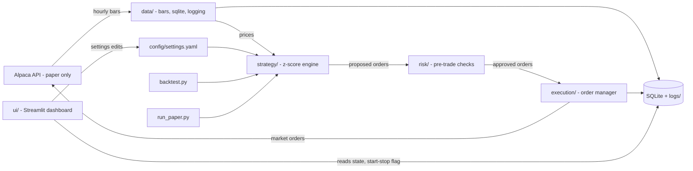
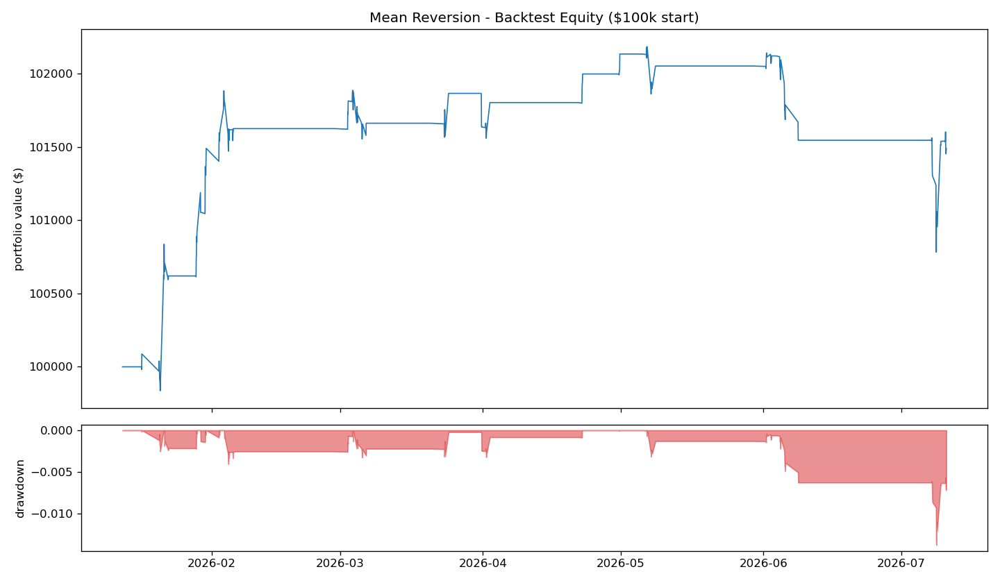

# Alpaca Mean Reversion Trading System

By Jason Zou and Ignacio Lopez Amartino — FINM 25000, Summer 2026

End-to-end systematic trading system for FINM 250 Project Alpaca. It trades trend-filtered mean reversion on 5 liquid cyclical stocks (MOS, LEN, LYB, DVN, HAL); BTC/USD and ETH/USD are supported but off by default because exchange fees ate the crypto sleeve's edge. All orders go to Alpaca in paper trading mode only. No real money is ever at risk.

The strategy started life losing -7.6% per half-year and now makes +1.8% net per year with a -1.4% max drawdown. The full story of that turnaround - what was broken, how it was diagnosed, and which fixes survived out-of-sample validation - is in [CHANGELOG.md](CHANGELOG.md).

## Overview

The system pulls hourly bars from Alpaca and computes a rolling z-score of each price against its own 20-bar mean. When a price is stretched more than 2.5 standard deviations from its mean - and only when the dislocation is a pullback within the larger trend, not a move with it - it bets on reversion. Positions are sized by realized volatility. Every order passes hard risk checks before it is sent. One shared engine runs in two modes: a 6-month backtest with simulated fills and transaction costs, and a live paper trading loop that polls every minute. A Streamlit dashboard monitors positions and P&L and controls the loop.

## Architecture



Module layout:

- `config/` - settings.yaml holds tickers and all parameters. `.env.example` holds dummy keys.
- `data/` - Alpaca client wrapper with retry and backoff, hourly bar fetcher, SQLite store, logging setup.
- `strategy/` - z-score math, sizing and the decision engine shared by both modes.
- `risk/` - pre-trade checks and stop-loss detection. Every opening order passes through here.
- `execution/` - order manager. SimBroker fills instantly for backtests. PaperBroker sends real paper orders and tracks their state.
- `ui/` - Streamlit dashboard.
- `tests/` - pytest units for the strategy math and each risk check.
- `backtest.py` - backtest mode entry point.
- `run_paper.py` - paper trading mode entry point.

## Setup

1. Install Python 3.11 or newer.
2. Install dependencies:

```
pip install -r requirements.txt
```

3. Create an Alpaca account and generate paper trading API keys from the paper dashboard.
4. Copy the key template to the project root and fill in your own keys:

```
cp config/.env.example .env
```

Edit `.env` so it contains your paper key id and secret. The file is listed in `.gitignore` and never leaves your machine. Keys are loaded only through python-dotenv. Never commit real keys.

## Running

Backtest mode pulls 6 months of hourly bars, replays them through the engine and writes a report:

```
python backtest.py
```

It prints cumulative P&L, max drawdown, trade count and hit rate. It saves an equity curve plot and csv files to `charts/`.

Paper trading mode polls for fresh bars every minute and trades the live paper account:

```
python run_paper.py
```

Add `--once` to run a single polling cycle and exit. The loop runs until you stop it with ctrl-c or the dashboard Stop button.

The dashboard reads the same SQLite database and log files the loop writes:

```
streamlit run ui/app.py
```

It shows connection state, mode, market status, last data time, positions with P&L, the equity curve, recent signals, orders and fills. The sidebar starts and stops the strategy and edits tickers and risk limits. Edits persist to `config/settings.yaml` and apply on the loop's next poll. Stop pauses new entries only - exits, stop-losses and snapshots keep running so open positions stay managed. Ctrl-c terminates the process.

## Strategy

Per asset, the signal is a rolling z-score of the hourly close against its own 20-bar mean. A long opens when z crosses below -2.5 with price above its 100-bar moving average (buy the dip, but only in an uptrend). A short opens when z crosses above +2.5 with price below the average, stocks only - crypto is long-only because Alpaca does not support shorting crypto, and stock shorts can be disabled with `allow_shorts`. The position closes when the absolute z comes back inside 0.5 (the reversion mostly happened) or bails immediately if z blows out past 3.0 against it (the reversion thesis broke). Position sizes scale inversely with each asset's realized volatility, so risky assets get less money. The full intuition and the reasoning behind every threshold are in `strategy/README.md`.

The trend filter is the load-bearing rule. On the out-of-sample half-year (Jul 2025 - Jan 2026, untouched during tuning), every tested configuration with it on was profitable and every one with it off lost money, because it keeps the strategy from fading real repricings and cuts stop-loss hits from 37 to 1.

## Risk controls

Three hard limits are enforced in `risk/checks.py` before any opening order is sent:

- max 15% of equity in any single asset
- max 100% gross exposure across the book
- minimum order size to block dust orders

A 5% stop-loss per position is checked on every bar and overrides all other logic. Closing orders skip the caps on purpose because they reduce risk. Backtests also charge 5 bps per stock fill and 25 bps per crypto fill (`cost_bps` / `crypto_cost_bps`) so reported returns are net of realistic frictions.

## Performance snapshot



The included 6-month backtest (January to July 2026, $100k start, net of 5 bps/fill costs) finishes +1.5% with a -1.4% max drawdown, a 73.9% hit rate over 23 trades and $207 of modeled costs. On the out-of-sample prior half-year (July 2025 - January 2026) the same configuration makes +1.1% net with a -1.1% drawdown, versus -4.7% for the unfiltered baseline; over the full year it is +1.8% net with a Sharpe of about 0.4. Trade counts are small, so these numbers demonstrate that the risk architecture works, not that the edge is statistically proven - the strategy is a demonstration of system engineering, not a claim of alpha.

## Limitations

- Backtest fills happen at the signal bar's close with a flat per-fill bps cost model (no spread dynamics or impact). Paper fills are real Alpaca paper fills. A fill-delay test showed instant fills do not flatter this strategy - waiting a bar actually helped - so the sim is conservative on timing.
- The free data plan blocks the most recent 15 minutes of SIP data, so bars are fetched 16 minutes behind real time. Harmless for an hourly signal, but this is not a low-latency system.
- The paper loop polls once a minute. It does not stream ticks and cannot react intra-minute.
- Stops are checked on hourly closes. A gap through the stop level fills beyond -5%.
- The trend filter is a blunt regime proxy. It stood the strategy down correctly through the H1-2026 oil rally, but a 100-bar SMA lags at turning points and the universe is ~2 effective macro bets (the LYB/DVN/HAL oil cluster dominates), so factor concentration risk remains.
- With the filter on, the strategy trades ~40 times a year. That is by design (each trade has positive expectancy net of costs) but the small sample means the edge is not statistically proven.
- Crypto fees are taken in the asset, so a round trip leaves cents of dust and small P&L drag. At Alpaca's ~25 bps taker fee the whole crypto sleeve was net-negative over the tested year, which is why BTC/ETH default to off.
